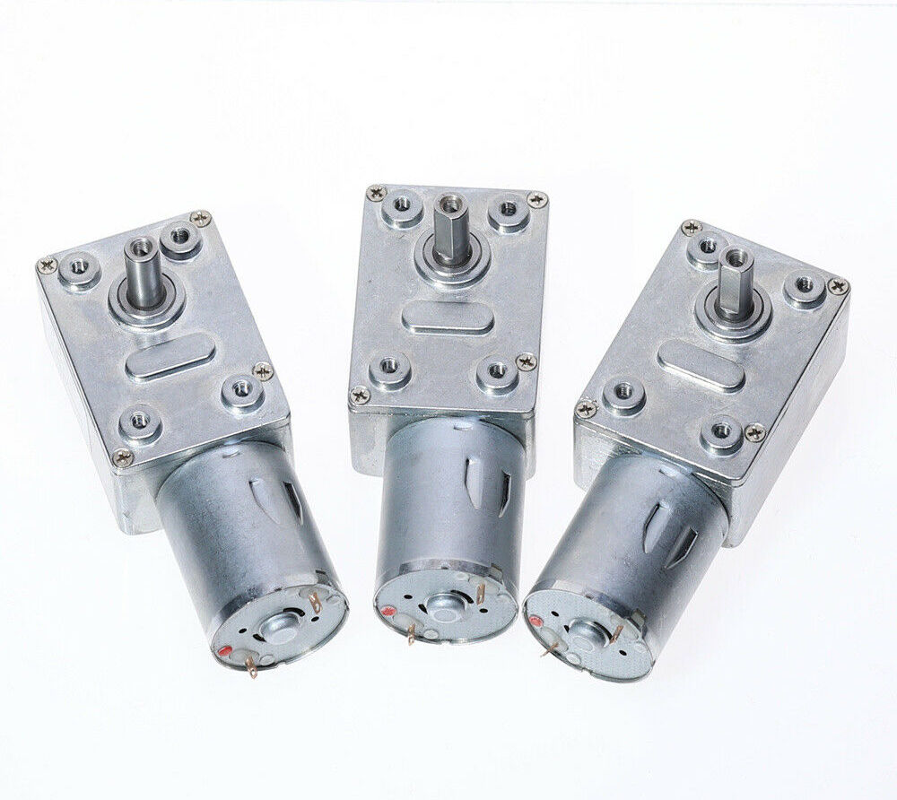

# THIR
_(That's How I Roll)_

## Open Source Aquarium Roll Filter

**THIR** is a build it yourself roll-filter for your aquarium.

## About THIR

Automatic roll filters are generally very expensive to buy and maintain despite the cost of materials and construction techniques being relatively cheap and easy to undertake. The idea of *THIR* is to design and make available plans for an automatic roll filter that anyone can put together at home. 

## How do Roll Filters work?

Automatic roll filters use a long strip of filter media wound onto a roll, much like a toilet roll. A length of media is unwound from the roll and water is passed through it. Particulates and waste become trapped in the media allowing the cleaned filtered water to pass through. When the media becomes blocked new media is then automatically indexed off of the roll presenting clean media to the water flow. Used media is wound onto a waste roll where it is collected until the filter roll has been used.

## Why do we need yet another roll filter?

There are many examples of roll filters now on the market, with a variety of designs, some good, some bad.

Having been an early adopter of roll filters I discovered that there were lots of improvements that needed to be made to the unit I had before it could really be considered reliable. In fact I ended up redesigning pretty much all of it.

It was whilst I was on this journey of repair and rebuild that I realised that paying several hundred dollars for a few dollars worth of perspex, an inferior design and a cheap $2 motor was an absolute travesty. Especially when I did not even manage to get to the end of the first filter roll before the machine broke. So I had the idea of making an improved roll filter and selling it. 

Fast forwards two years and I still haven't gotten around to making roll filters. So I thought that perhaps instead of selling filters, I should simply give the design away and allow others to build on the work I had already done.

## Basic design constraints

- The design is a simple clear perspex box with an open top.
- There are perches on the top of the box to hold a filter roll and waste roll.
- Media is transported from the media roll to the waste roll by driving the waste roll
- The media is passed around removable rollers at the bottom of the box so that the media is presented against the inside faces of the box
- Rollers are removable to aid with roll change
- There are holes in the faces of the box to allow water to pass through the media and out of the box
- The waste roller is driven by a 2 or 3 rpm motor and gearbox.
- The motor is operated by a simple float switch
- Design should be scalable so that it can be made larger / smaller to suit different tanks / flow rates
- Design should be easily removable / dismantle-able to aid cleaning and roll changes
- Design should be easy to assemble and very importantly easy to get square!!!

## Roll filter media

One of the biggest complaints about roll filters is the cost of the media. I have been running weed matting in my machine for about the past year with no issues. Weed matting comes on a 900/1000mm wide roll. I simply cut the roll into appropriately size smaller rolls which fit into my machine. I tried a variety of different materials including 'interfacing' commonly used by dressmakers and quilters as well as other non-woven fibers.

You may need to experiment a little to find a suitable local source. I found that getting a sample of the material and then doing a simple 'tap test' was enough to determine how well the material flowed water. Some materials did not pass water at all and the water simply rolled off. This was especially true of some of the 'interfacing' fabrics which contained a heat activated glue. These were obviously no good.

  
I also analysed the fabric under a microscope to determine the size of the holes. Being a non-woven fabric the holes are irregularly sized so you need to do some a bit of mathematics and average out the sizes. This is not an exact science, but then I expect that most of what is sold comprises of 90% marketing waffle and 10% fact.

TIP: _If you want to have a go at measuring the holes, you can easily make a guide from a human hair. The average hair is about 60 microns wide._

I found that that a 10 micron filter roll was almost too small, especially when used on a small unit like I'm using (3000l/h), The filter roll ended up consumed very quickly, in fact when I initially tried it my water was obviously too dirty and the filter box simply overflowed as if the media was not passing anything. Smaller weave filter media requires very large filter boxes and wide filter rolls to get the flow required so make this a factor when building your box.

The 'weed matting' material I use is just a generic non-woven material sold as 'weed matting' It was available in white and also a dark grey colour. I elected to use the white so that the residue was easier to see. Under the microscope I noted that the material had holes as large as 60 microns, but that most of the holes were much smaller. This worked really well on my machine and did not result with the roll getting consumed to quickly.

Of course YMMV and you will probably have no way of testing the effectiveness of any filter media you find until you build a filter box. So for this reason I recommend that you build a 'standard' width box. That is a box that will use off-of the shelf filter media. It's also a good idea to buy at least one roll of standard filter media so that you can get up and running straight away. This way you will also know what to expect performance-wise.

## How to make the THIR filter.

### The filter box

The components are laser cut perspex. You should be able to get these cut locally at any laser cutting service. You may also be able to get them cut at your local makerspace / hackerspace. 

All components slot together with castellated joints. This ensures that the filter box is square. The squareness of the box is VERY important as if it is not perfectly square your rollers will not be aligned and the filter media will have a tendency to 'track' to one side.

There are several holes in the box that need to be tapped for M5 plastic screws. These include the bottom roller fixings, the hanging bracket fixing, the drive roller mounts and the float switch mount

### Drive motor

The drive motor is a regular 2rpm 12Vdc worm geared motor with metal gearbox. Mounting holes are pre-cut in the box sides. The motor should be mounted with stainless steel M5 screws

The motor has a 6mm shaft with a M1 17 tooth nylon drive spigot fitted

The float switch is connected in series with the motor and PSU

I recommend a 12Vdc plug top PSU. 0.5A should be plenty

Waterproof all connections with heat shrink.

### Waste filter roll

Possibly the hardest part of the build is making the waste roller. The M1 48 tooth gear has to be glued in the correct position. The roller also has to be the correct width to fit in the guides. Trial fit the roller before gluing.

## Using the filter roller.

### Installing filter roll

Installing the filter roll for the first time is pretty simple.

- Install the filter roll ensuring that the roll unwinds to the bottom.
- Pull a length of filter material from the roll
- Fold the end of the roll over and back on itself aligning the edges of the roll. This ensures a straight edge.
- Using a length of tape fix the end of the roll to the bottom of the waste roller
- Plug the unit in an operate the float switch to roll filter material around the waste roller 
- Push the loop of filter material downwards into the filter box
- Install the two lower rollers
- Unplug unit
- Hang unit on side of tank / refuge / etc
- Adjust mounting bracket until the bottom of the unit is submerged.
- plug unit back in - you are good to go.
- adjust tension on filter material by rolling back excess material on to filter roll.

### Changing filter rolls

- Unroll end of old filter roll.
- Overlap new filter roll and old filter roll
- Staple media together
- Carefully draw join through filter by manually pulling filter media
- When join has passed through machine, remove old filter roll, discard waste media and affix new media to roll using tape as before